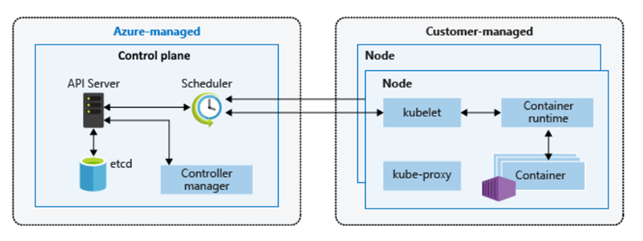
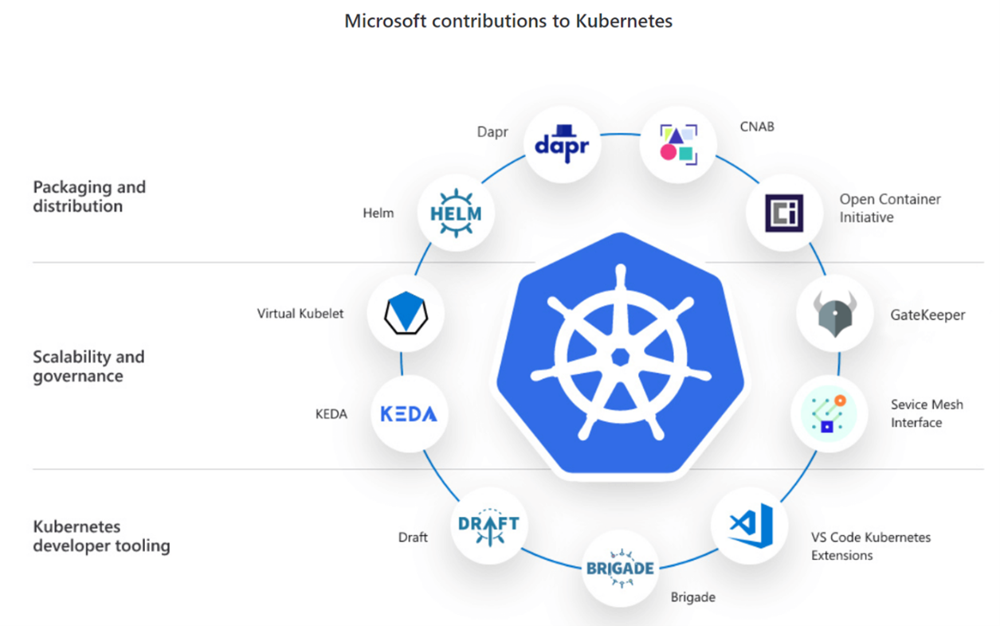
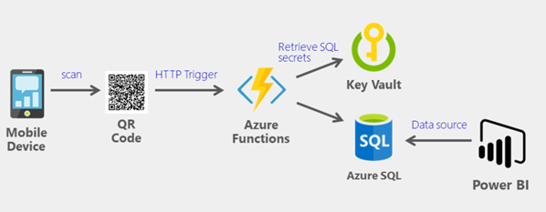
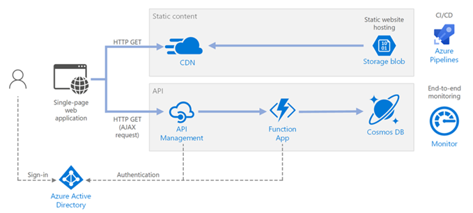
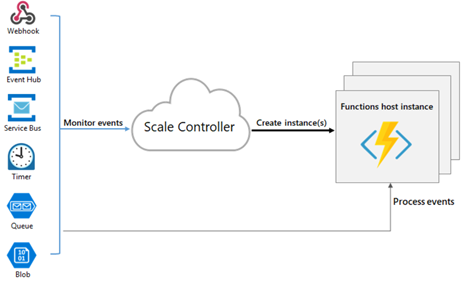

## Where does their code run?

All the cool kids are using containers these days and it's probably the single best place for code to
run as it opens up a whole load of hosting opportunities - containers work with both Linux and
Windows, and are programming language agnostic, so ideal older legacy code and as well as the
more modern .NET Core and .NET 5. PaaS offerings on Azure, such as App Services for example, are
increasingly moving over to containerisation as a strategic direction, given its widespread adoption
in the ecosystem and all the tooling support that comes with that. As a general guide it's always
good to look at where the engineering effort is happening with the product team and prioritise
those technologies, as they will typically have a longer life cycle and be safer bets.

Examples of containers support on Azure:

* Single machine – Azure Container Instances 
* Web sites – Azure App Services for Containers
* Microservice solutions – Azure Kubernetes Services

Virtual Machines are mostly viewed now as a legacy construct and not part of a modern cloud native, and mostly only suited for lift and shift scenarios from either an on-premise data centre or from another cloud provider.

Without a doubt Kubernetes is one of the hottest and most interesting technologies for deploying code and most system architects will either already be already using it, or at least thinking about it and perhaps running some pilots, so it’s a good place for discussion, especially as we have a fantastic Kubernetes offering in the form of Azure Kubernetes Services (AKS). However, Kubernetes is a complex piece of technology and takes a certain effort to set up and run efficiently, and every now and again we do see projects where the developers seem to have shoehorned it in, as an excuse to play with it, rather than because it's the best solution!

Anyone having these high-level architectural discussions does need to have a basic understanding of Kubernetes as a platform, and AKS as a deployment platform on Azure. Fortunately, there are lots of great resources out there many of which will take you on a guided journey to help skill yourself up on this key piece of technology 

* ["What is Kubernetes"](https://azure.microsoft.com/topic/what-is-kubernetes/)
* The [YouTube channel with Brendan Burns](https://www.youtube.com/playlist?list=PLLasX02E8BPCrIhFrc_ZiINhbRkYMKdPT) is an excellent resource to understand the key concepts 
* The Microsoft Learning Path "[*50 days from zero to hero with Kubernetes*](https://azure.microsoft.com/resources/kubernetes-learning-path/)"
* [Microsoft AKS Documentation](https://docs.microsoft.com/azure/aks/)

And don't forget that Microsoft is very active in the Kubernetes community so worth highlighting areas where we're really leading the way:

If you are from a Windows background one of the things you will notice is that Kubernetes is still very much rooted in the world of Linux and while Windows containers are supported, it's fair to say that they represent the exception rather than the rule and if you're going to go down the Kubernetes route then Linux is probably going to be the operating system of choice. For traditional Microsoft developers used to .NET this means that moving to .NET Core or .NET 5+ is the best platform for them to develop on as it gives them choice in their operating system.

One of the other interesting area to explore is a **Serverless architecture**. Many systems have an **event driven** nature to them where an external event triggers code that needs to execute, whether that's data landing in a storage account, at HTTP or a time-based event.  Event driven architecture lends itself very well to serverless computing in that the development team don’t have to explicitly manage the code environment – its handled by the system, which is responsible for detecting an external event and wiring up the appropriate code handling. **Azure Functions** is our serverless technology, and any architectural discussion should include exploration for event driven service opportunities and look for a potential match with Azure Functions.

Azure Functions are easy to design for and set up - the system handles all the complexities around the underlying server infrastructure, and all the programmer has to do is focus on the code that needs to be executed and leave almost everything else to the system. It also has a great costing model in the form of a **Consumption Plan** which means you really only do pay for what you use, which is a really popular option and can help in cost management discussions.

In more complex microservice style systems, Azure Functions often end up acting as the ‘glue’ to link the various parts of the system together but provide a decoupling mechanism which helps keeps the whole system more scalable, and resilient and robust, by making the system less brittle.

[Source](https://docs.microsoft.com/en-us/azure/architecture/reference-architectures/serverless/web-app)

It's very easy to get excited about the elastic scale that Azure Functions offer to handle variable load, but it's important to understand scale control and the ability to limit that scale because, if a function scales too much it can create problems further downstream for other parts of the system and their ability to cope.

[Source](https://docs.microsoft.com/en-us/azure/azure-functions/functions-scale)
