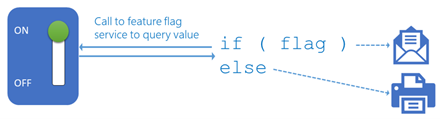

## Do they have a DevOps process and culture?

One of the easiest ways to assess the maturity of a partner is to inquire about the DevOps culture and in particular find out if they have a full CI/CD pipeline. Can they track who made what change, why and when, ensuring it goes through a pipeline and then is deployed when it reaches the appropriate quality level. The opposite to that is - do they let their support team or engineers just dive straight into the Azure portal and make changes as and when they need to. If that is the case then they need to change the way they work!

One of the most inspirational books that helps set the tone and importance of the whole DevOps and its role in busines is [**The Phoenix Project**](https://www.e4developer.com/2018/03/24/the-phoenix-project-a-key-to-understanding-devops/) - and well worth both reading yourself if you're new to this area and to recommend to customers if they don't see the value!

If you want to get a quick understanding of where a partner is in terms of DevOps capability you can use the [**DevOps Checklist**](https://docs.microsoft.com/azure/architecture/checklist/dev-ops) to get a quick sense and you can see that it already covers far more than just having a pipeline set up for code delivery, ranging from team and organisational structure through to validating features with customer usage.

There’s a tension with many partners where they assume that Continuous Delivery means taking changes from a developer and immediately deploying to a customer environment. This generally leads to conversations around compliance, governance and security which can slow down and block the adoption of continuous delivery techniques. It is therefore beneficial to instead focus on the ability to take control of your deployments.

Continuous deployment ensures you can deploy value to a customer when you choose, rather than having this process blocked for technical or other reasons.

## Common objections to Continuous Delivery

* **We only deploy to our customers every x, where x is a value usually measured in months or years**
* **Deployments are the responsibility of another team**
* **We have no control of our customers environment**

These questions are very common, can occur for many reasons and can generally be answered in the same way. Perhaps the partner is providing packaged software, a mobile application or software for customers to deploy themselves.

This is a common scenario and having the ability to continuously deploy to a customer is different than deploying to a customer. What if there was an urgent security fix, are your customers comfortable that you’re unable to patch it?

* **Our QA process is not mature enough to handle this, we don’t have automation**

Let’s be honest, no development process is perfect. Bugs will happen and things will go wrong. The only way to start getting better is to start. A good first step is to have people responsible for quality be part of the team. It is important this team don’t suddenly get extra responsibility for testing more changes and not feel empowered to block poor quality changes early or to invest in automation.

There is also a critical role for manual QA, even in an environment that is otherwise completely automated. For example, in DevOps you can define an environment with a manual set of approvals from a team which effectively pauses the execution of the pipeline until changes have been reviewed.

* **Our contract doesn’t allow us to modify a customer's environment**

It is important to understand what is permitted, however it should be enforced through a process rather than the best intentions of your developers and operations teams. Having a documented, machine-enforceable set of guardrails that prevent modifications, or allow an audited list of changes is a better approach.

Overall release processes should be boring and reliable. The same process should be used to deploy to every environment for every type of change so that the process itself is continuously tested and fixed as early in the development process as possible. You don’t want to be running a special one-off deployment process to production at 2am whilst everything is on fire as it has the highest changes of something going wrong.

[Feature Flags](https://docs.microsoft.com/dotnet/architecture/cloud-native/feature-flags) are a really great capability that can help in the DevOps process, but they can make a system more complex, so does need to be used with caution. But if a partner does experience difficulties with DevOps, it's well worth exploring the ability to switch features on and off at the flick of a button, giving them a lot of agility and control.

For further reading there’s a great book that covers the principals in far more detail than here **Continuous Delivery: Reliable Software Releases through Build, Test, and Deployment Automation** (Addison-Wesley). 

