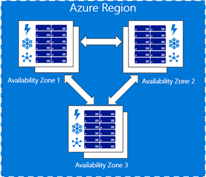
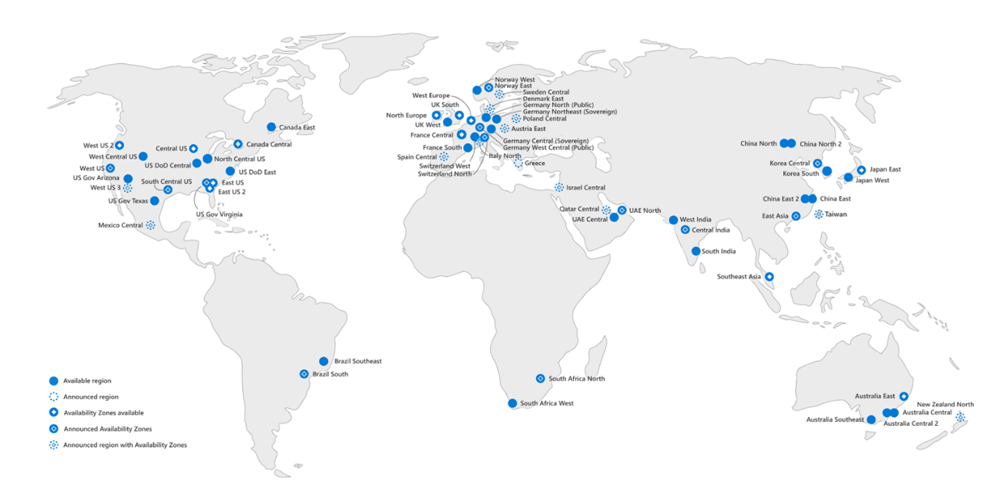

## How are they addressing High Availability, Business Continuity, and Disaster Recover?

As the old adage goes, bad things happen to good systems, and architects and systems designers need to plan for failure and have an effective strategy to cope with it. There are many facets to this area so it's worth breaking it down into several different constituent parts.

This is subject the architects and system designers need to not only embrace and design for, but to also test and retest until they are satisfied. A disaster recovery plan that is never been executed isn't really a disaster recovery plan, so always ask when a failover test was last run and ask to see the report! And then ask if the operations team know when and how to initiate and the process.

One way to get the right mindset is to explore [**Chaos Engineering**](https://docs.microsoft.com/en-us/azure/architecture/framework/resiliency/chaos-engineering). Developers can be overly optimistic in their assumptions about both the quality of their own code and the system as a whole. Chaos engineering is all about bringing that element of doubt and destruction into play. **Chaos Monkey**. There are a lot of articles out there that are well worth reading - https://www.gremlin.com/chaos-monkey/, https://www.infoworld.com/article/3543233/what-is-chaos-monkey-chaos-engineering-explained.html - but a key idea is rather than assume bad things will never happen to a system, we deliberately, under controlled conditions, introduce failure and then analyse its impact and the blast radius. If a development team know their system will be brought down as part of the control experiment they are likely to spend much more engineering effort understanding the impact and how to design for resilience. Be sure to checkout some of the things that we are doing in this space around chaos engineering and fault injection - [Advancing resilience through chaos engineering and fault injection](https://azure.microsoft.com/en-us/blog/advancing-resilience-through-chaos-engineering-and-fault-injection/)

**Have they done a single point of failure analysis**? Once the system is up and running it's very easy to believe that the hard work has been done and the system is ready for use. This is the point to ask whether they've done a single point of failure analysis i.e. if a specific module or service fails, how would it impact their system? Developers tend to be optimistic in nature, and assume things will work, and haven't necessarily perform this type of analysis, so if an outage impacts Azure, or one of their services fails, they are often taken by surprise and don't understand the implications of ramifications of such a failure. So, before a failure impacts a production system, analyse the critical paths, look at the assumptions that have been made in the design and ensure that everyone is comfortable with the appropriate level of resilience built into the system.

Azure services are well placed to support developers, but it requires some research work, on a service-by-service basis, to understand the SLAs and the different tiers and their capabilities. 

One of the most important innovation of recent years has been Azure Availability Zones and so it's critical to understand what they are, how they work and how they relate to the different services:

[Source](https://docs.microsoft.com/en-us/azure/availability-zones/az-overview)

**What SLA to they offer their customers**? It's critical to ask this question and ensure the people designing the system understand what it is that they are promising their customers. If they already have an SLA in place then they need to review that against the services they are building on and ensure they can actually meet their contractual requirements. If they haven't an SLA then they should offer one. but take care to build it based on solid engineering and the capability of the underlying services rather than just pick a number out of thin air.

In addition to an SLA, **Recovery Time Objective** (RTO) and **Recovery Point Objective** (RPO) are two key parameters that businesses should understand and agree on, before creating their business continuity and disaster recovery plans. The Recovery Time Objective is a metric that defines the time to recover services following a disaster, to ensure on-going business continuity. The Recovery Point Objective is a measure of the maximum tolerable amount of data that the business can afford to lose during a disaster.

Together these metrics will help define the appropriate technologies and architectures that underpin a business continuity and disaster recovery architecture. For example, they will define how frequently the data needs to be replicated to a secondary source, which will impact the technology choice. Similarly, when a system needs to fail over to a secondary location, it defines how quickly that system needs to be stood up and be fully operational.

Most elements of this discussion include the **doomsday scenario** of a full data centre region being unable to function at which point the solution needs to fail over to a secondary data centre region. Azure has an inbuilt concept of data centre region pairing, where each data centre region is paired with another, the idea being that if a system needs to fail over from one data centre region to another it fails over too it's twin.

In the UK there is **UK South** and **UK West**, in Europe, there is **North Europe** and **West Europe**, etc

The great news is that this is a well understood area and there is a lot of excellent documentation that can help navigate this topic

* https://docs.microsoft.com/en-us/azure/data-explorer/business-continuity-overview
* https://docs.microsoft.com/en-us/azure/best-practices-availability-paired-regions

However, there is still quite a lot of work to potentially do in this area because you must look at data and compute and network traffic on a service-by-service basis to piece together the best solution.

There are also a few cases where a service may not necessarily be available in both paired regions, so do be careful in your research.
