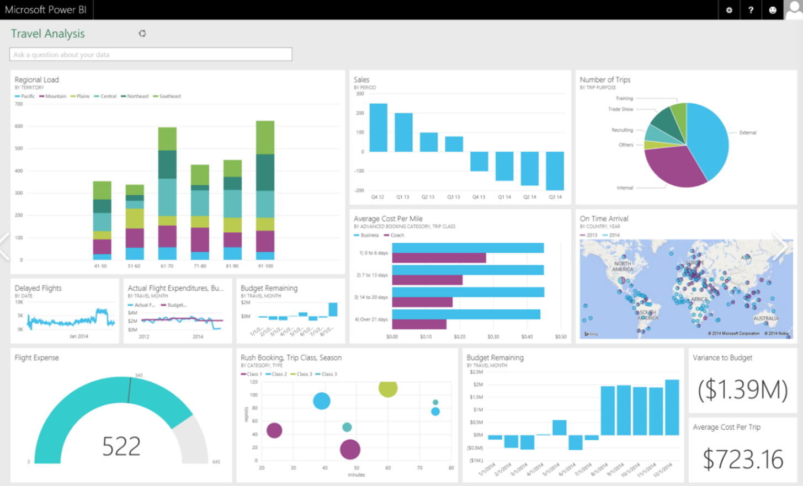

## How do they provide reports and dashboards?

Reports, and by this we mean everything from good old fashion paginated reports through to powerful interactive dashboards, is an interesting area for ISVs. It's something that's very important for end users, but it's also something thing that's typically low on the priority list for software developers, often because traditionally reports need to be heavily customized for each customer and it's difficult to programmatically cater for all the variants of reports that each and every person want. This often ends up being expensive to implement, and have limited functionality or need to go through many iterations to get them correct.

This has very much changed and there is a much bigger drive towards self-service portals that allow the ISV to build the infrastructure for the reports, and then let the end user customise them as needed. This is a great conversation to have because we have a great solution to this problem in the form of **Power BI** and in particular Power BI Embedded. This allows the partner to easily build reports and dashboards, which can often be done by business users, rather than developers, and can then very quickly be built directly into the application without the end user needing to be aware of the underlying technology.

[Implementing Power BI Embedded](https://docs.microsoft.com/power-bi/developer/embedded/embed-sample-for-customers?tabs=net-framework) is not a huge investment either. We run 3 day hacks every quarter and consistently have partners build Power BI into their solution in day 1 or 2, then spend the remaining time discussing security and how to do DevOps for reporting.

Whilst Power BI embedded is often the best solution for an ISV, it will not necessarily always be so. Ion general when talking about how to share Power BI reports with a customer it comes down to the following 4 solutions:

* [Power BI Embedded](https://docs.microsoft.com/power-bi/developer/embedded/azure-pbie-what-is-power-bi-embedded) – the partner is in complete control of the visualisations and data models, but can grant users the ability to edit reports or build their own for no extra cost
* [Azure B2B](https://docs.microsoft.com/power-bi/admin/service-admin-azure-ad-b2b) – invite customer users into the partner’s Power BI tenant. They can purchase licenses for these users, or the customers can bring their own license. The partner can then control what access that user has by sharing an app or making them a member of a workspace
* [Power BI template](https://docs.microsoft.com/power-bi/create-reports/desktop-templates) – the partner can share a file with a customer. The customer will need a login to the underlying data source, or they could point Power BI report to data that they own. The customer is in complete control and will need to license Power BI themselves
* [Power BI template App](https://docs.microsoft.com/power-bi/connect-data/service-template-apps-overview) – the partner can deploy an App to the marketplace, they can then control if customers can just view this or build their own. The customer will need their own Power BI license

If a partner is migrating from a SQL Server Reporting Services (SSRS) solution that they are using today, they can still use Power BI Premium or Power BI Embedded.

Yes, there is still a valid use case for using paginated reports! Paginated reports are designed to be printed or shared. They're called paginated because they're formatted to fit well on a page. They display all the data in a table, even if the table spans multiple pages. They're also called pixel perfect because you can control their report page layout exactly. Power BI Report Builder is the standalone tool for authoring paginated reports for the Power BI service.

The only important to note here is that if the partner is using Power BI Embedded they will need to use a SKU or [A4 or upwards](https://docs.microsoft.com/power-bi/admin/service-admin-premium-workloads#default-memory-settings).

Once a partner has decided to use Power BI the main questions will always be:

* How do I secure my solution? - [Using row-level security with embedded content in Power BI embedded analytics](https://docs.microsoft.com/power-bi/developer/embedded/embedded-row-level-security)
* How do I plan for or do capacity planning? - [Power BI embedded analytics capacity planning](https://docs.microsoft.com/power-bi/developer/embedded/embedded-capacity-planning)
* (Sometimes) How do I performance tune my solution? - [Power BI Embedded performance best practices](https://docs.microsoft.com/power-bi/developer/embedded/embedded-performance-best-practices)

Fortunately, in each of these cases, and for almost everything in Power BI, the documentation is very good.
