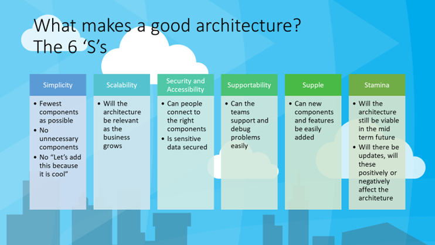
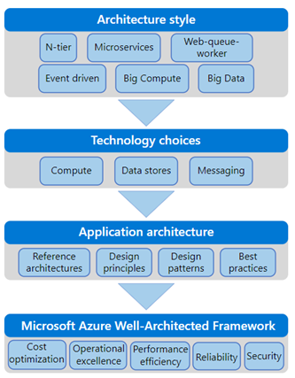

## Have they designed an architecture that follows best practice guidelines?

There is no such thing as a best practise, but when having architectural and design conversations, it's always good to find out where their influences for design come from, and what steps they have taken to validate their thinking and guide them in their design principles.

**Are they making full use of the elastic nature of the cloud**? It may seem an obvious question to ask but many architects and designers who don't have a background in cloud development have a fixed mindset and don't necessarily grasp all the nuances and opportunities that a truly scalable and elastic cloud platform can offer. One simple question is to ask is **"are there are any serverless elements to the system?"** If there is, it is more likely they've thought about the event driven aspects of the system and are trying to design a more consumption based model, where they only pay for the resource is they used. But scale can be more subtle than that - for example, scaling up a database when they do a big import and then shrinking it back down when the import has been completed is a simple and effective way for a system to run but is very much at odds with the more traditional on-premise way of working.

There are lots of resources to support architects and the **Azure Architecture Center** is a great starting point - https://docs.microsoft.com/azure/architecture/

Many people have listed guiding design principles, such as these 10 principles https://docs.microsoft.com/azure/architecture/guide/design-principles/

* Design for self-healing. In a distributed system, failures happen. Design your application to be self-healing when failures occur.
* Make all things redundant. Build redundancy into your application, to avoid having single points of failure.
* Minimize coordination. Minimize coordination between application services to achieve scalability.
* Design to scale out. Design your application so that it can scale horizontally, adding or removing new instances as demand requires.
* Partition around limits. Use partitioning to work around database, network, and compute limits.
* Design for operations. Design your application so that the operations team has the tools they need.
* Use managed services. When possible, use platform as a service (PaaS) rather than infrastructure as a service (IaaS).
* Use the best data store for the job. Pick the storage technology that is the best fit for your data and how it will be used.
* Design for evolution. All successful applications change over time. An evolutionary design is key for continuous innovation.
* Build for the needs of business. Every design decision must be justified by a business requirement.

To compliment this, there are lots of code-based design patterns around that can help support these architectural principles, and a good system designer will be aware of many of them, and should lean on them to help address well understood problems.

**Cloud Design Patterns** list may of the common patterns - [Cloud design patterns - Azure Architecture Center](https://docs.microsoft.com/azure/architecture/patterns/)

Some of the more **advanced patterns** are well worth being familiar with to see the variety of approaches that software engineers can bring to bear on complex systems:

* **Command and Query Responsibility Segregation (CQRS)**, separate reads from writes - https://docs.microsoft.com/azure/architecture/patterns/cqrs
    * Often used with **Materialized View pattern** - https://docs.microsoft.com/azure/architecture/patterns/materialized-view 
* **Event Sourcing**, an append only approach to data - https://docs.microsoft.com/azure/architecture/patterns/event-sourcing
* **Lambda architecture**, to support fast and slow moving data - https://en.wikipedia.org/wiki/Lambda_architecture
* The **Actor Model**, for complex concurrent systems - https://en.wikipedia.org/wiki/Actor_model

Again, there are no right or wrong answers here come up but the very process of going through these design principles, and architectural guidance is really just to minimise risk and make sure but architects are following good solid principles that are well proven and understood.
